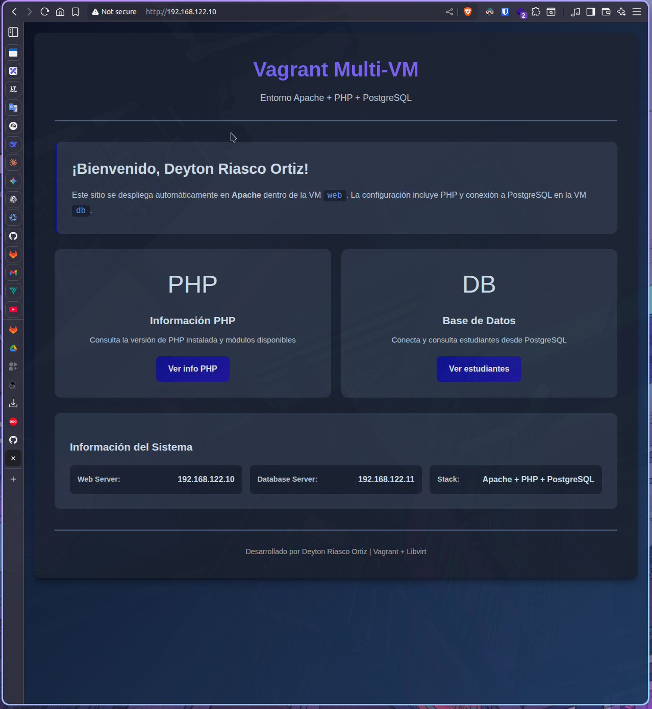
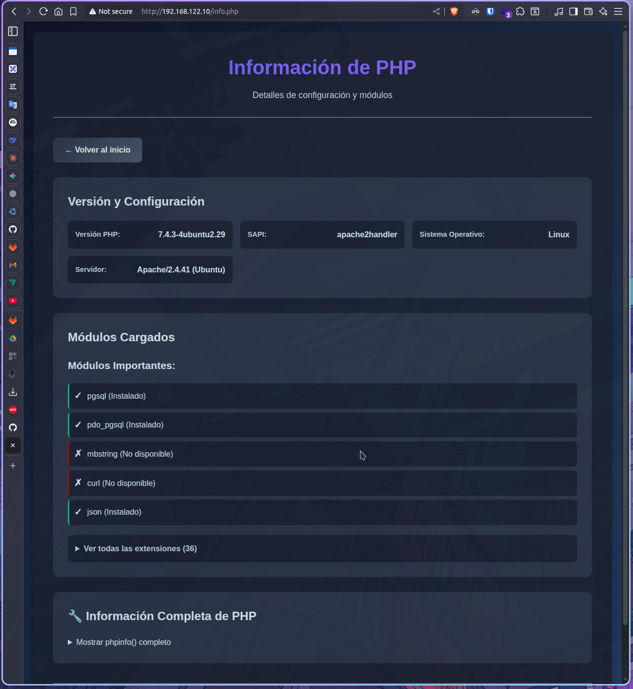
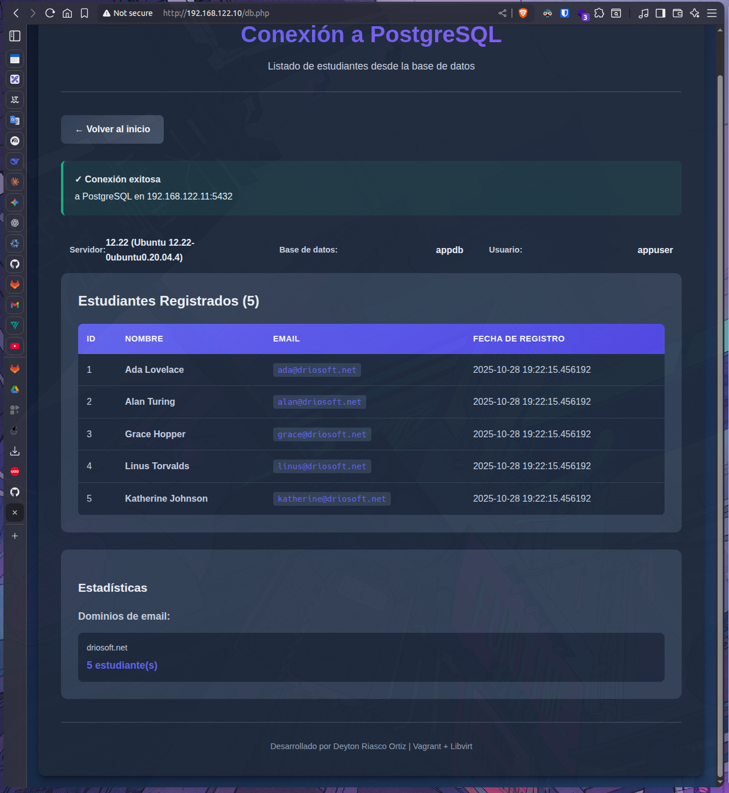

# Vagrant Multi-VM: Apache + PHP + PostgreSQL

Proyecto de infraestructura como código usando Vagrant y Libvirt para desplegar un entorno web con Apache, PHP y PostgreSQL en máquinas virtuales separadas.

---
### Index


### php


### db


---

## Descripción

Este proyecto crea un entorno de desarrollo completo con dos máquinas virtuales:

- **VM Web** (`192.168.122.10`): Servidor Apache con PHP
- **VM DB** (`192.168.122.11`): Servidor PostgreSQL con datos de ejemplo

### Características

✅ Aprovisionamiento automático con scripts bash  
✅ Interfaz web moderna y responsive  
✅ Conexión PHP a PostgreSQL  
✅ Base de datos con datos de ejemplo (estudiantes)  
✅ 3 vistas diferentes (Home, Info PHP, Base de Datos)  

---

## Requisitos Previos

Antes de comenzar, asegúrate de tener instalado:

1. **Vagrant** (versión 2.2.0 o superior)
```bash
   vagrant --version
```

2. **Libvirt** y complementos
```bash
   # En Ubuntu/Debian
   sudo apt-get install -y qemu-kvm libvirt-daemon-system libvirt-clients bridge-utils
   
   # Plugin de Vagrant para Libvirt
   vagrant plugin install vagrant-libvirt
```

3. **Rsync** (para sincronización de archivos)
```bash
   sudo apt-get install rsync
```

---

## Estructura del Proyecto
```
vagrant-multi-vm/
├── Vagrantfile              # Configuración de las VMs
├── provision-web.sh         # Script de aprovisionamiento para VM web
├── provision-db.sh          # Script de aprovisionamiento para VM db
├── www/                     # Contenido del sitio web
│   ├── index.html          # Página principal
│   ├── info.php            # Información de PHP
│   ├── db.php              # Conexión a base de datos
│   └── style.css           # Estilos CSS
└── README.md               # Este archivo
```

---

## Instalación y Uso

### 1. Clonar el Repositorio
```bash
# Clonar el proyecto
git clone <tu-repositorio>
cd vagrant-multi-vm
```

O crear la estructura manualmente y copiar los archivos.

### 2. Verificar Estructura

Asegúrate de que la carpeta `www/` exista y contenga los archivos:
- `index.html`
- `info.php`
- `db.php`
- `style.css`

### 3. Levantar las Máquinas Virtuales
```bash
# Iniciar ambas VMs
vagrant up

# O iniciar una VM específica
vagrant up web
vagrant up db
```

**Nota:** El primer `vagrant up` descargará la box `generic/ubuntu2004` (~500MB) y puede tardar varios minutos.

### 4. Verificar Estado
```bash
# Ver estado de las VMs
vagrant status

# Debería mostrar:
# web    running (libvirt)
# db     running (libvirt)
```

### 5. Acceder a las Aplicaciones

Una vez que las VMs estén ejecutándose, abre tu navegador:

| Ruta | URL | Descripción |
|------|-----|-------------|
| **Home** | http://192.168.122.10 | Página principal de bienvenida |
| **Info PHP** | http://192.168.122.10/info.php | Información de PHP y módulos |
| **Base de Datos** | http://192.168.122.10/db.php | Listado de estudiantes desde PostgreSQL |

---

## Comandos Útiles

### Gestión de VMs
```bash
# Detener las VMs
vagrant halt

# Reiniciar las VMs
vagrant reload

# Reiniciar con re-aprovisionamiento
vagrant reload --provision

# Eliminar las VMs
vagrant destroy

# SSH a una VM específica
vagrant ssh web
vagrant ssh db
```

### Re-sincronizar Archivos

Si modificas archivos en `www/`, re-sincroniza con:
```bash
vagrant rsync web
```

### Ver Logs
```bash
# Logs de Apache (dentro de VM web)
vagrant ssh web -c "sudo tail -f /var/log/apache2/error.log"

# Logs de PostgreSQL (dentro de VM db)
vagrant ssh db -c "sudo tail -f /var/log/postgresql/postgresql-*.log"
```

---

## Pruebas

### 1. Verificar Conectividad

Desde tu máquina host:
```bash
# Ping a VM web
ping -c 3 192.168.122.10

# Ping a VM db
ping -c 3 192.168.122.11
```

### 2. Probar Apache
```bash
curl http://192.168.122.10
```

Deberías ver el HTML de la página principal.

### 3. Probar PostgreSQL

Desde la VM web:
```bash
vagrant ssh web
psql -h 192.168.122.11 -U appuser -d appdb -c "SELECT * FROM students;"
# Password: appsecret
```

### 4. Verificar PHP

Accede a http://192.168.122.10/info.php y verifica:
- ✅ Módulo `pgsql` instalado
- ✅ Módulo `pdo_pgsql` instalado

### 5. Verificar Base de Datos

Accede a http://192.168.122.10/db.php y verifica:
- ✅ Conexión exitosa a PostgreSQL
- ✅ Listado de 5 estudiantes

---

## Base de Datos

### Información de Conexión

| Parámetro | Valor |
|-----------|-------|
| **Host** | 192.168.122.11 |
| **Puerto** | 5432 |
| **Base de datos** | appdb |
| **Usuario** | appuser |
| **Contraseña** | appsecret |

### Estructura de Tabla
```sql
CREATE TABLE students (
  id SERIAL PRIMARY KEY,
  name TEXT NOT NULL,
  email TEXT NOT NULL UNIQUE,
  created_at TIMESTAMP DEFAULT CURRENT_TIMESTAMP
);
```

### Datos de Ejemplo

La base de datos incluye 5 estudiantes:
1. Ada Lovelace (ada@example.com)
2. Alan Turing (alan@example.com)
3. Grace Hopper (grace@example.com)
4. Linus Torvalds (linus@example.com)
5. Katherine Johnson (katherine@example.com)

---

## Solución de Problemas

### Error: "No se pudo conectar a PostgreSQL"

**Solución:**
```bash
# 1. Verificar que la VM db esté ejecutándose
vagrant status

# 2. Reiniciar VM db
vagrant reload db --provision

# 3. Verificar servicio PostgreSQL
vagrant ssh db -c "sudo systemctl status postgresql"
```

### Error: "Página no encontrada"

**Solución:**
```bash
# 1. Re-sincronizar archivos
vagrant rsync web

# 2. Verificar Apache
vagrant ssh web -c "sudo systemctl status apache2"

# 3. Verificar permisos
vagrant ssh web -c "ls -la /var/www/html"
```

### Error: "Box 'generic/ubuntu2004' no encontrada"

**Solución:**
```bash
# Agregar la box manualmente
vagrant box add generic/ubuntu2004 --provider libvirt
```

### Red 192.168.122.x no accesible

**Solución:**
```bash
# Verificar red libvirt
sudo virsh net-list --all

# Si está inactiva, iniciarla
sudo virsh net-start default
sudo virsh net-autostart default
```

---

## Personalización

### Modificar Contenido Web

Edita los archivos en `www/` y ejecuta:
```bash
vagrant rsync web
```

### Cambiar Credenciales de Base de Datos

Edita `provision-db.sh` y modifica:
```bash
DB_NAME="tudb"
DB_USER="tuusuario"
DB_PASS="tucontraseña"
```

Luego re-aprovisiona:
```bash
vagrant reload db --provision
```

### Agregar Más Datos

Conéctate a la VM db y ejecuta:
```bash
vagrant ssh db
sudo -u postgres psql -d appdb
INSERT INTO students (name, email) VALUES ('Nuevo Estudiante', 'nuevo@example.com');
```
---

## Contribuciones

Las contribuciones son bienvenidas. Para cambios importantes:

1. Fork el proyecto
2. Crea una rama (`git checkout -b feature/mejora`)
3. Commit tus cambios (`git commit -m 'Agregar mejora'`)
4. Push a la rama (`git push origin feature/mejora`)
5. Abre un Pull Request

---

## Licencia

Este proyecto es de código abierto y está disponible bajo la licencia MIT.

---

## Autor

**Deyton Riasco Ortiz**

- Este es un fork del proyecto original de [jmaquin0](https://github.com/jmaquin0/vagrant-web-provisioning.git)
- Proyecto: Vagrant Multi-VM
- Stack: Vagrant + Libvirt + Apache + PHP + PostgreSQL

---

## Referencias

- [Documentación de Vagrant](https://www.vagrantup.com/docs)
- [Vagrant Libvirt Provider](https://github.com/vagrant-libvirt/vagrant-libvirt)
- [PostgreSQL Documentation](https://www.postgresql.org/docs/)
- [PHP PostgreSQL Extension](https://www.php.net/manual/es/book.pgsql.php)

---

**¡Disfruta tu entorno de desarrollo!**